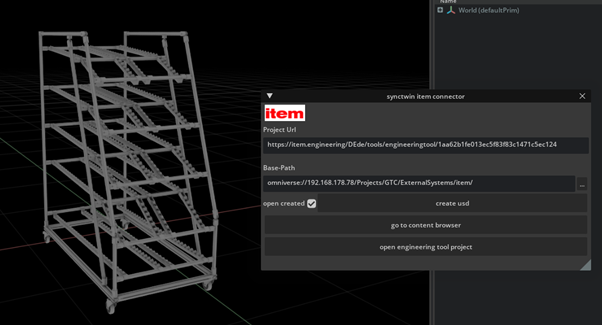

# item engineering tool connector by synctwin

easily export your construction projects to Omniverse 

Get it from here: https://github.com/mtw75/item_extension/archive/refs/heads/master.zip

[Reference Manual](exts/synctwin.item.connector/docs/README.md)

### about synctwin GmbH:
synctwin GmbH is a spinoff of ipolog GmbH and a member of the actano group

see http://www.ipolog.ai/synctwin/

 