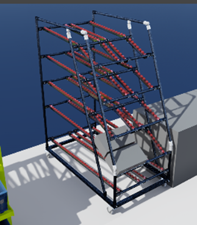

# item engineering tool connector by synctwin

easily export your construction projects to Omniverse 

Imports highly detailed CAD data from item engineering tool webapp into an USD file

| Element            | Description |
|--------------------|--------|
| *“Project Url“* | url of the construction project |
| *“Base-Path”* | base path for imported USD files, there are two subdirectories: |
| |  [base path]/projects  - contains result rack project files – reference these into your scenario |
| |  [base path]/parts – parts used in project racks are referenced in the project rack files  |
| *“create usd”* | creates a USD from given project Url.  |
| *“open created”* | If this is checked the created USD file is opened after creation.|
| *“go to content browser”* | finds the resulting USD in the content browser |
| *“open engineering tool project”* | opens project in engineering tool web app|

